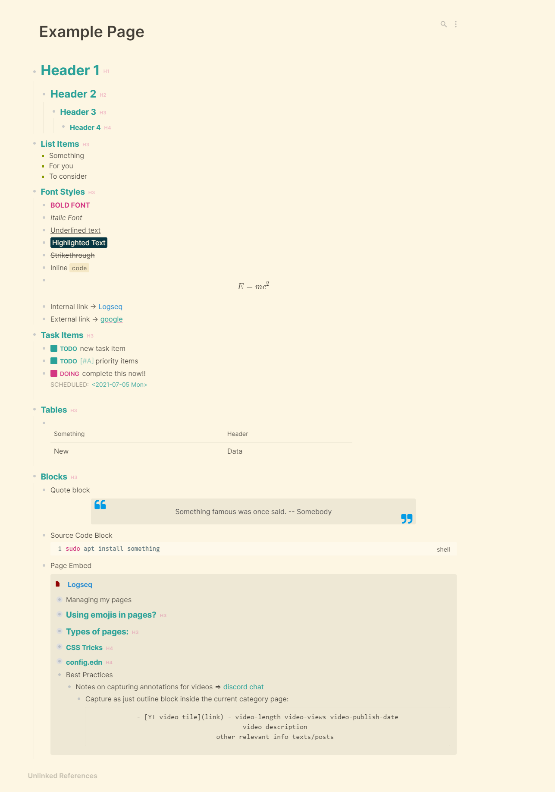
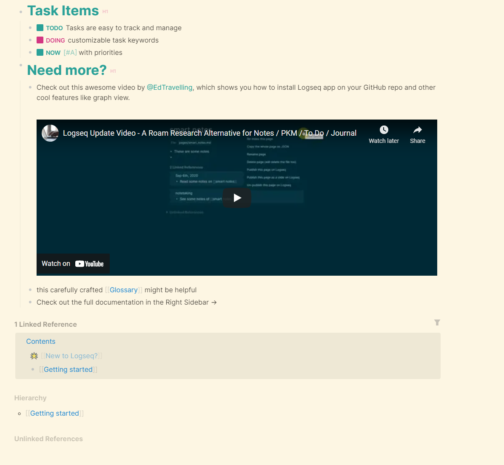

# logseq-solarized-light
A solarized light theme for LOGSEQ

Quickest way to get started is by importing my CSS theme into your `custom.css` file, or download this repository and add the folder as a plugin.
``` css
@import url("https://cdn.jsdelivr.net/gh/nmartin84/logseq-solarized/solarized.css");
```



